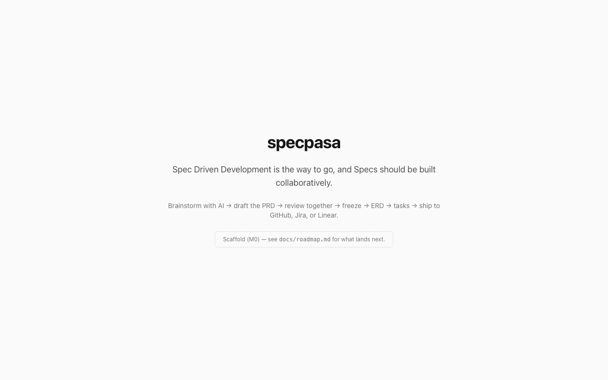

# specpasa

> **Spec Driven Development is the way to go, and Specs should be built collaboratively.**

specpasa is a self-hosted visual spec builder. Start from rough thoughts and references, brainstorm with AI into a draft PRD, review it together with inline comments, iterate through immutable versions, freeze — then carry the spec forward: **PRD → ERD → TASKS**, ending as real work items in GitHub Issues, Jira, or Linear.

**Goal:** make Spec Driven Development the way of development — connected to the tools, distributed among team members, no silos; add value, not friction.

<picture>
  <source media="(prefers-color-scheme: dark)" srcset="docs/assets/landing-dark.png" />
  
</picture>

## How it works

1. Create a **project**, invite members, and capture an **intent**.
2. Open a blank **spec**, dump rough thoughts and references (links, files, GitHub code).
3. Let AI draft the PRD — using your **local CLI** (claude, codex), **local Ollama**, or **cloud providers** (Anthropic, OpenAI, Google, OpenRouter, any OpenAI-compatible endpoint).
4. Teammates comment inline on blocks; threads are resolved; every iteration is a new immutable version.
5. **Freeze** the PRD → start the **ERD** phase: reference source code, weigh options, draw mermaid diagrams.
6. Freeze the ERD → break it down into **tasks**, group into epics, and export to GitHub, Jira, or Linear.
7. Fork any spec from any version to explore a different direction.

## Status

Early — milestone **M0 (scaffold)** is complete. See [docs/roadmap.md](docs/roadmap.md) for what lands next, and the spec documents this project was (of course) built from:

- [Product requirements](docs/prd.md)
- [Domain model](docs/domain-model.md)
- [Architecture & ADRs](docs/architecture.md)

## Development

Requirements: Node ≥ 22, pnpm ≥ 11.

```sh
pnpm install
cp .env.example .env        # set SPECPASA_SECRET
pnpm db:migrate             # creates data/specpasa.db (SQLite by default)
pnpm dev                    # http://localhost:4321
```

`pnpm test`, `pnpm typecheck`, and `pnpm lint` cover the workspace. The repo is a pnpm monorepo: `apps/web` (Astro 7 + React islands), `packages/core` (domain logic), `packages/db` (Drizzle), `packages/providers` (AI adapters).

## Self-hosting

```sh
docker compose up            # SQLite in ./data by default
docker compose --profile postgres up   # optional Postgres for teams
```

The Node/Docker deployment is the default target — it's what enables local CLI and Ollama detection. A Cloudflare Workers target (cloud AI only) is planned; see ADR-2 in [docs/architecture.md](docs/architecture.md).

## License

AGPL-3.0-only
