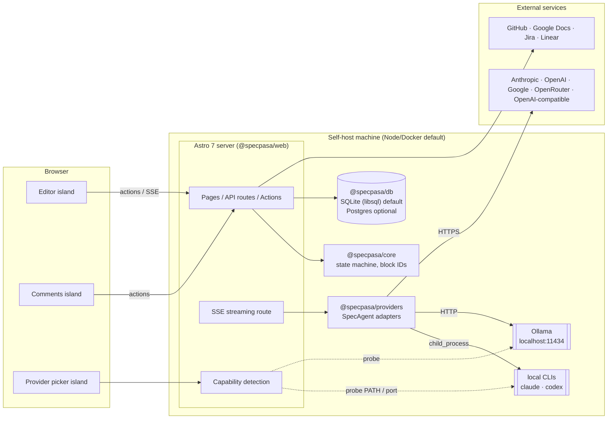

# specpasa — Architecture & Decision Records

> Companion documents: [prd.md](./prd.md) (what we're building and why),
> [domain-model.md](./domain-model.md) (entities and ERD), [roadmap.md](./roadmap.md) (milestones).

## 1. System overview

specpasa is a self-hostable web application. One deployable unit (the Astro app) serves
the UI, the API, and the AI/integration plumbing. Domain logic and persistence live in
workspace packages so they stay independent of the web framework and reusable by future
surfaces (a CLI, MCP servers, a local bridge daemon).

### Monorepo layout

```
specpasa/
├── apps/
│   └── web/                  # @specpasa/web — Astro 7 app: pages, API routes, islands
└── packages/
    ├── core/                 # @specpasa/core — domain types, phase/status state machine, block-ID utils
    ├── db/                   # @specpasa/db — Drizzle schema, dual-dialect client factory, migrations
    └── providers/            # @specpasa/providers — SpecAgent interface + AI provider adapters
```

Dependency direction is strictly downward: `web → providers → core` and `web → db → core`.
`core` depends on nothing but the standard library. Nothing imports from `web`.

### Request flow

```
Browser (React islands) ──HTTP/SSE──▶ Astro server routes & actions
                                          │
                                          ├─▶ @specpasa/core      (validate transitions, anchor comments, block IDs)
                                          ├─▶ @specpasa/db        (Drizzle → SQLite/libsql | Postgres | D1)
                                          ├─▶ @specpasa/providers (SpecAgent → local CLI | Ollama | cloud APIs)
                                          └─▶ integrations        (GitHub, Google Docs, Jira, Linear)
```

- **Mutations** go through Astro Actions (typed, validated server functions). Every
  mutation that touches spec content or lifecycle calls into `core` first — the state
  machine is the single authority on what transitions are legal.
- **AI generation** streams: the editor island opens an SSE connection to a server
  route, which pipes tokens from the active `SpecAgent` adapter.
- **Reads** are server-rendered pages; islands hydrate only where interaction demands it.

### High-level system diagram



### Islands vs server rendering

| Surface                                                          | Rendering                                      | Why                                                                        |
| ---------------------------------------------------------------- | ---------------------------------------------- | -------------------------------------------------------------------------- |
| Dashboards, project/intent/spec lists, version history, settings | Server-rendered Astro pages                    | Read-heavy, navigational; zero client JS needed                            |
| Spec editor (markdown + block gutter)                            | React island                                   | Keystroke-level interactivity, AI streaming, later swaps to a CRDT surface |
| Inline comment threads                                           | React island                                   | Optimistic posting, resolve/reopen, later realtime                         |
| AI chat / brainstorm panel                                       | React island                                   | Streaming tokens, provider switching                                       |
| Mermaid diagram blocks                                           | Server-rendered, island fallback for edit mode | Diagrams are content; editing is interaction                               |

---

## 2. Decision records

### ADR-1 — Stack: Astro 7 + React islands + Drizzle + pnpm workspace

**Context.** specpasa is mostly content pages (specs are documents) with a few islands of
deep interactivity (editor, comments, AI panel). We need SSR, streaming, a path to
Cloudflare, and a stack the team already knows. Candidates: Next.js (traderpasa),
Nuxt (printpasa), Astro 7.

**Decision.** Astro 7 with React islands, Drizzle ORM, pnpm workspace monorepo.

- Astro's islands model matches the product shape: server-render documents, hydrate only
  the editor/comments/AI surfaces. No app-wide client runtime tax on every spec view.
- Astro 7's `src/fetch.ts` entrypoint exports the standard fetch-handler pattern used by
  Cloudflare Workers, Deno, and Bun — the optional edge target (ADR-2) is idiomatic, not
  a port.
- First-class `@astrojs/cloudflare` adapter plus Astro 7's experimental Cloudflare CDN
  cache provider.
- Drizzle is already proven in printpasa and is the only mainstream ORM with equally good
  SQLite/libsql, Postgres, and D1 support (ADR-3).
- pnpm workspace mirrors traderpasa conventions; packages give clean seams for future MCP
  servers and a possible local bridge daemon.

**Consequences.** Two rendering paradigms (Astro pages + React islands) instead of one;
contributors must know where the island boundary sits. Astro's app-framework ecosystem is
thinner than Next.js — auth and forms are hand-rolled or small libraries, not batteries
included. Accepted: the product is document-first, and the boundary discipline keeps the
app fast by default.

### ADR-2 — Deploy model: Node/Docker default, Cloudflare Workers optional

**Context.** The product promise includes detecting and using _local_ AI: `claude` and
`codex` CLIs on the host, and Ollama at `localhost:11434`. Cloudflare Workers cannot
spawn processes and cannot reach a user's localhost. But some teams are cloud-AI-only and
want zero-ops edge hosting.

**Decision.** The default, fully-featured deployment is a Node server in Docker on the
user's own machine or server. Cloudflare Workers is a supported _optional_ target that
runs in cloud-AI-only mode; capability detection (ADR-4) reports local providers as
unavailable and the UI degrades gracefully.

| Capability                                                                 | Node/Docker (default)            | Cloudflare Workers (optional) |
| -------------------------------------------------------------------------- | -------------------------------- | ----------------------------- |
| Local CLI adapters (claude, codex)                                         | ✅ child_process                 | ❌ not possible               |
| Ollama (localhost)                                                         | ✅ HTTP probe + use              | ❌ not reachable              |
| Cloud providers (Anthropic, OpenAI, Google, OpenRouter, OpenAI-compatible) | ✅                               | ✅                            |
| Database                                                                   | SQLite file (libsql) or Postgres | D1                            |
| Realtime transport (ADR-6)                                                 | SSE now, WebSockets later        | Durable Objects later         |
| File/reference storage                                                     | local disk                       | R2                            |

**Consequences.** Every feature must either work on both targets or degrade explicitly —
the capability-detection endpoint is the single source of truth the UI reads. CI builds
both targets so drift is caught early. Local-AI features are documented as Node-only.

### ADR-3 — Database: dual-dialect Drizzle (SQLite default, Postgres optional, D1 on CF)

**Context.** Individuals self-hosting want zero-dependency startup; teams want
concurrent-write-safe Postgres; the Cloudflare target only offers D1 (SQLite dialect).

**Decision.** One Drizzle schema, two dialects. Default is a libsql/SQLite file (works
out of the box, and is what D1 speaks). Postgres is an opt-in docker-compose profile via
`DATABASE_URL`. To keep the schema portable we constrain ourselves to the common subset:

- Column types limited to `text`, `integer`, and JSON-serialized-as-`text`.
- Primary keys are application-generated ULIDs (sortable, no DB sequences/autoincrement).
- Timestamps stored as epoch-milliseconds integers, converted at the edge.
- No dialect-specific features in the core schema: no Postgres enums (enums are `text`
  checked in `core`), no JSONB operators in queries, no triggers, no partial indexes.
- Migrations generated per dialect by `drizzle-kit` from the same schema source.

**Consequences.** We give up some Postgres power (JSONB indexing, pgvector) in the core
schema; if RAG-over-references later needs pgvector, it lands in a Postgres-only optional
module, never in core tables. Dual migration sets must both be generated and tested in CI.

### ADR-4 — AI provider layer: one `SpecAgent` interface, many adapters

**Context.** The same drafting/refining flows must run against local CLIs, local Ollama,
and any cloud provider — selectable per workspace or per user, with graceful absence.

**Decision.** `@specpasa/providers` defines a single interface, roughly:

```ts
interface SpecAgent {
  readonly kind: ProviderKind; // 'local_cli' | 'ollama' | 'openai_compatible' | 'anthropic'
  draft(input: DraftRequest): AsyncIterable<AgentChunk>; // blank/rough thoughts → draft
  refine(input: RefineRequest): AsyncIterable<AgentChunk>; // version + comments → revision
  summarize(input: SummarizeRequest): AsyncIterable<AgentChunk>;
}
```

All methods stream. Adapters:

- **Local CLI** — spawns `claude` / `codex` via `child_process`, non-interactive print
  mode, stdout parsed to chunks. Node target only.
- **Ollama** — HTTP to `localhost:11434` (host-configurable), streaming chat API.
- **OpenAI-compatible** — one adapter covers OpenAI, OpenRouter, Google's
  OpenAI-compatibility endpoint, and any custom `baseURL` (LM Studio, vLLM, …).
- **Anthropic** — official SDK for native streaming and prompt caching.

A **capability detection** endpoint (`/api/capabilities`) probes the host at startup and
on demand: known CLI names on `PATH`, TCP/HTTP probe of the Ollama port, presence of
configured cloud credentials. The UI's provider picker renders only what's actually
available. Provider configs are workspace- or user-scoped; API keys are encrypted at rest
(AES-GCM with a server secret from the environment), never sent to the browser.

**Consequences.** The interface is the contract — adding a provider is one adapter file
plus a capability probe. CLI adapters are inherently less structured than APIs (stdout
parsing, version drift across CLI releases); they ship late (M5) and behind capability
detection. Streaming-first design means even non-streaming providers are wrapped to emit
chunked output.

### ADR-5 — Editor & versioning: Markdown blocks with stable IDs, immutable snapshots

**Context.** Specs need inline comments anchored to content, an audit trail of
iterations, fork/freeze semantics, and — later — Google-Docs-style live co-editing. Full
CRDT now would dominate the build; plain markdown strings would make comment anchoring
and a later CRDT migration painful.

**Decision.** A spec's content is an ordered list of markdown blocks; each block carries
a stable ULID `block_id` assigned at creation and preserved across edits. Saving produces
a new **immutable** `SpecVersion` (full snapshot, parent pointer, `ai_generated` flag).
Comment threads anchor to `(spec_id, block_id)` plus an optional text range — because
block IDs survive edits, a thread follows its block across versions; if the block is
deleted the thread is marked orphaned, never lost.

This is deliberately the anchor model a CRDT needs: when live co-editing arrives (M5+),
Yjs replaces the _edit surface_ while blocks, versions, and comment anchors keep the same
identity scheme — a snapshot version becomes a tagged point in CRDT history. No schema
migration.

**Consequences.** Versions are whole snapshots, so storage grows with iteration count —
acceptable for text; revisit with content-addressed block dedup if it ever matters.
Block-level (not character-level) anchoring is coarser than Google Docs comments; the
optional text range narrows it. Editor must maintain block identity through
splits/merges (`core` owns those rules).

### ADR-6 — Realtime: optimistic + SSE now, WebSockets/Durable Objects later

**Context.** Multi-user inline commenting eventually wants live presence and instant
propagation. v1 has no realtime infrastructure, and the two deploy targets (ADR-2) want
different transports.

**Decision.** v1 ships optimistic UI plus cheap freshness: comment posts render
immediately, and open spec views refresh comment state via polling/SSE on the Node
target. Comments and resolutions are modeled as **append-only events** in the schema, so
"what changed since cursor X" is a trivial query. Later, the same event feed is pushed
over WebSockets (Node) or fanned out by a per-spec Durable Object (Cloudflare) — the
transport upgrades, the data model doesn't.

**Consequences.** v1 collaboration is near-realtime, not realtime — fine for
review-and-comment workflows. The append-only discipline costs a little write complexity
now but makes the M5 upgrade purely additive.

**Status (M5).** Shipped on the Node target: an SSE stream per open spec
(`/api/specs/:id/events`) pushes comment-changed signals and connection-derived presence
from an in-process hub; the rail falls back to polling if the stream closes. The hub is
single-process by design — multi-process Node needs a shared broker, and the Cloudflare
target still awaits Durable Objects.

### ADR-7 — Integrations: sink adapters, MCP-ready

**Context.** Frozen specs must flow outward: PRD/ERD documents to GitHub (markdown in a
repo) or Google Docs; TASKS-phase epics/tasks to GitHub Issues, Jira, or Linear. The
vision explicitly wants these to be composable, possibly as MCP servers.

**Decision.** One adapter interface per sink with two capabilities:

```ts
interface IntegrationSink {
  readonly kind: SinkKind; // 'github' | 'google_docs' | 'jira' | 'linear'
  exportDocument?(doc: SpecExport): Promise<ExportRecord>; // GitHub markdown, Google Docs
  createTasks?(plan: TaskExport): Promise<ExportRecord>; // GitHub Issues, Jira, Linear
}
```

Every push writes an `ExportRecord` (what went where, external IDs) so exports are
idempotent and re-runs update rather than duplicate. GitHub ships first (octokit; both
capabilities). Adapters take plain inputs and return plain records — deliberately the
shape of an MCP tool — so each can later be exposed as a standalone MCP server without
rework, and third-party MCP servers can be mounted as additional sinks.

**Consequences.** Least-common-denominator interface: sink-specific richness (Jira custom
fields, Linear cycles) arrives via per-sink options objects, not interface growth.
OAuth/token storage reuses the encrypted-credentials machinery from ADR-4.

---

## 3. Cross-cutting notes

- **AuthN/AuthZ.** M1 ships single-admin auth; M2 adds invites and roles
  (owner/editor/commenter/viewer) enforced in Astro actions via `core` policy helpers.
  Sessions are cookie-based, server-side.
- **Secrets.** All provider/integration credentials encrypted at rest with a key from
  `SPECPASA_SECRET`; never rendered to the client.
- **Testing.** `core` is pure functions — unit-tested exhaustively (the state machine is
  the product's contract). `db` gets migration round-trip tests on both dialects.
  Adapters get contract tests against recorded fixtures.
- **Observability.** Structured logs from server routes; AI calls record provider, model,
  token counts, and duration on the version they produced (`SpecVersion.ai_generated`
  provenance).
