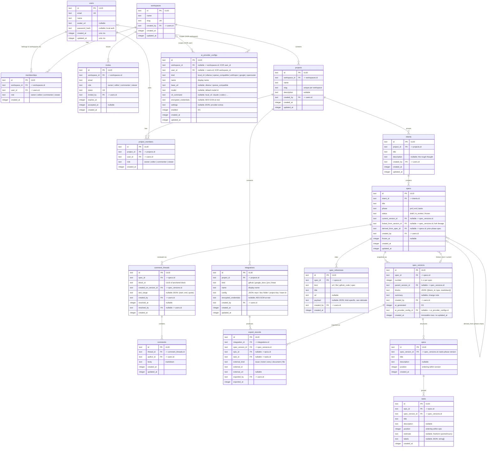

# specpasa — Domain Model

> Source of truth for the database schema in `packages/db`. Column names and types below are
> normative: snake_case names, SQLite-friendly types (`text` ULIDs for IDs, `integer` unix-ms
> timestamps, `integer` 0/1 booleans, `text` JSON columns). The Postgres dialect maps these
> 1:1 (JSON columns become `jsonb`).

## Hierarchy at a glance

```
Workspace ─┬─ Membership / Invite (people & roles)
           └─ Project ─┬─ ProjectMember
                       ├─ Integration ── ExportRecord
                       └─ Intent ── Spec ─┬─ SpecVersion (immutable) ─┬─ Epic ── Task
                                          ├─ CommentThread ── Comment └─ (blocks with ULIDs)
                                          └─ Reference
```

A **Spec** lives in exactly one phase (`prd` → `erd` → `tasks`). Freezing a spec in one phase
gates creating the next-phase spec. Content is never edited in place: every iteration produces
a new immutable **SpecVersion** made of ordered blocks, each with a stable `block_id` ULID —
the anchor primitive for comments today and CRDT co-editing later.

## ERD



Unique constraints beyond PKs: `memberships(workspace_id, user_id)`, `project_members(project_id, user_id)`,
`projects(workspace_id, slug)`, `spec_versions(spec_id, number)`, `invites(token)`, `users(email)`, `workspaces(slug)`.

## Rationale

### Immutable versions

A `spec_versions` row is never updated after insert. Iterating on a spec (by a human edit or an
AI refactor) inserts a new row with `parent_version_id` pointing at its predecessor and bumps
`specs.current_version_id`. This gives free history/diffing, makes "frozen" trivially enforceable
(freeze pins `current_version_id`; the state machine in `packages/core` rejects new versions),
and keeps AI provenance auditable per version via `ai_generated` + `ai_provider_config_id`.

### Blocks with stable ULIDs

`spec_versions.blocks` is an ordered JSON array of `{ block_id, type, markdown }` where `type` is
a coarse block kind (`heading`, `paragraph`, `list`, `code`, `mermaid`, `table`, ...). When a new
version is produced, unchanged and edited blocks **keep their `block_id`**; only genuinely new
blocks mint new ULIDs. Two payoffs:

1. **Comment anchoring now** — a thread anchored to a `block_id` re-attaches to that block in any
   version that still contains it, so review conversations survive iteration. If the block was
   deleted, the UI shows the thread against `created_on_version_id` as historical context.
2. **CRDT later** — Yjs models a document as identified fragments. Block ULIDs are exactly the
   identity a CRDT edit surface needs, so live co-editing can replace the editor without
   migrating versions or comments.

### Freeze and fork semantics

- **Freeze**: `status` moves `draft → in_review → frozen` (enforced in `packages/core`, mirrored
  by `frozen_at`). A frozen spec accepts no new versions or status regressions. Freezing is the
  gate for phase progression: creating an `erd` spec requires a frozen `prd` spec in the same
  intent, recorded via `derived_from_spec_id`; likewise `tasks` requires a frozen `erd`.
- **Fork**: forking starts a **new Spec** (fresh version history, `number` restarts at 1) whose
  `forked_from_version_id` points at the exact source version — lineage without entangling the
  original's status or comments. Forks are how teams explore competing directions from a common
  ancestor.

### CommentThread anchor shape

`(spec_id, block_id, created_on_version_id, text_range?)`. `text_range` (`{start, end, quote}`,
offsets into the block's markdown) narrows the anchor within a block; the stored `quote` allows
fuzzy re-anchoring when the block text shifts. Threads carry `resolved_at/resolved_by` — the
review loop is: comment → iterate (new version) → resolve. Comments are append-only events,
which keeps the door open for realtime fan-out (SSE now, WebSocket/Durable Objects later).

### AiProviderConfig scoping (workspace XOR user)

Exactly one of `workspace_id` / `user_id` is set (CHECK constraint). Workspace-scoped configs are
shared team defaults (e.g. the org's OpenRouter key); user-scoped configs are personal (e.g. _my_
local `claude` CLI or `localhost:11434` Ollama — which only exist on the machine running the
Node server anyway). Secrets live in `encrypted_credentials`, AES-GCM encrypted with a server-side
key; `local_cli` and `ollama` kinds typically need none.

### Reference payloads

`spec_references.payload` is kind-specific JSON:

- `url` — none (just `url`)
- `file` — `{ storage_path, mime, size }`
- `github_code` — `{ repo, ref, path, line_start?, line_end? }`
- `spec` — `{ spec_id, version_id? }` (cite another spec, optionally pinned to a version)

References are the curated context fed to the AI when drafting or refactoring a version.

### ExportRecord as the integration ledger

Every push through an `integrations` adapter writes an `export_records` row mapping internal
objects to external ones: an epic → GitHub issue / Jira epic / Linear project, a task → issue /
ticket / story, a whole `spec_version` → repo markdown file or Google Doc (`external_kind`
`document|file`, `epic_id`/`task_id` null). This makes exports idempotent (re-export updates the
known `external_id` instead of duplicating) and gives the UI stable backlinks (`external_url`).

### Epics and tasks

`epics`/`tasks` are the structured output of the `tasks` phase, denormalized from the version's
markdown blocks so they can be ordered (`position`), grouped, and exported individually. They hang
off the immutable `spec_version` they were finalized from; external identity after export lives in
`export_records`, not on the rows themselves.

### Out of scope here

Auth sessions/tokens arrive with M1 (single-admin auth) and are infrastructure, not domain.
Realtime presence needs no persistence in v1.
